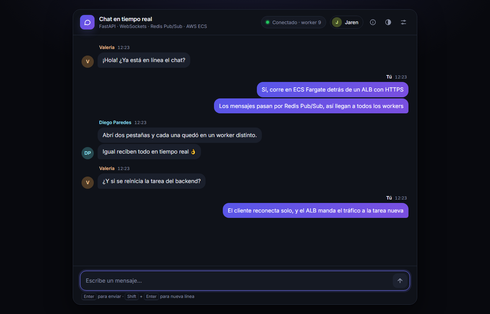
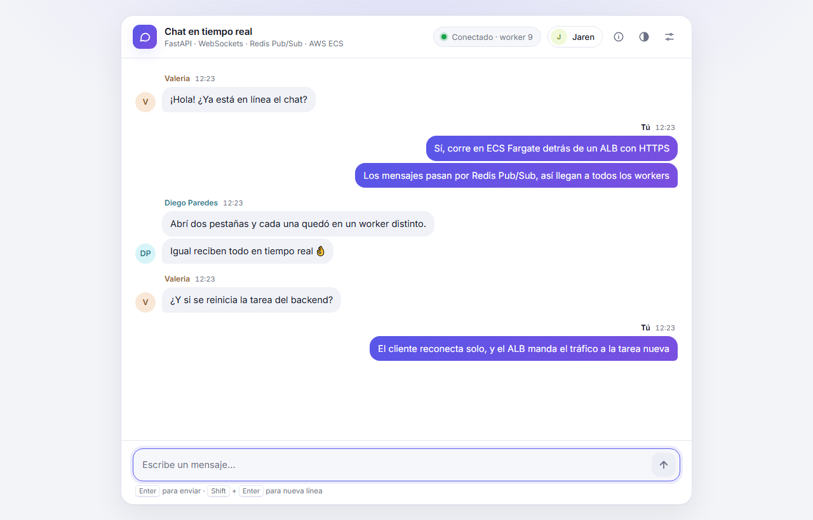
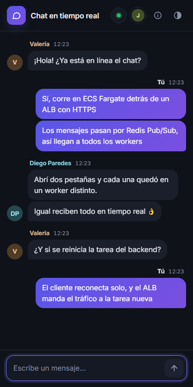
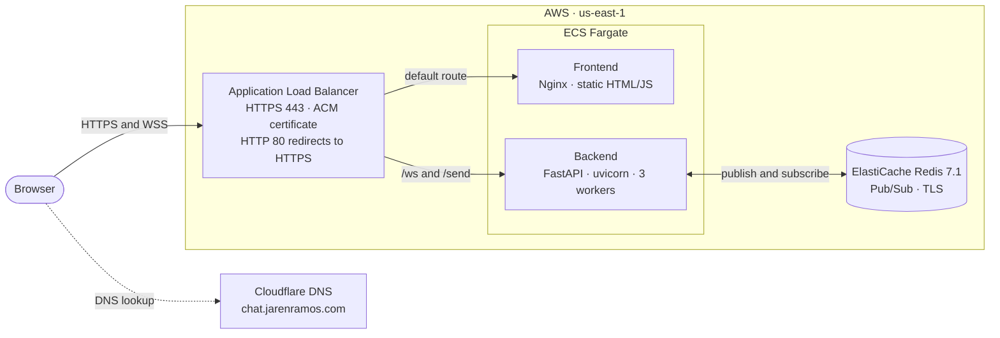

# Real-time chat on AWS ECS

A real-time group chat built with **FastAPI WebSockets** and **Redis Pub/Sub**, deployed on **AWS ECS Fargate** behind an **Application Load Balancer with HTTPS**. All the infrastructure is defined in **Terraform**.

**Live demo:** https://chat.jarenramos.com (the UI is in Spanish)



| Light mode | Mobile |
|---|---|
|  |  |

## The problem it solves

The backend runs **uvicorn with 3 workers** in each container. Every worker is a separate process with its own in-memory list of WebSocket connections, so a naive broadcast only reaches the clients connected to the worker that handled the request. Users on other workers never see the message.

The fix is **Redis Pub/Sub**: the worker that receives a message publishes it to a Redis channel, every worker is subscribed to that channel, and each one forwards it to its own clients. The status badge in the UI (`Conectado · worker 9`) shows which worker a tab is connected to. Open several tabs and they may land on different workers, but all of them receive every message.

## Architecture



**How a message travels**

1. The browser sends the message with `POST /send`.
2. The ALB routes it to a backend task, and the worker that receives it publishes it to Redis.
3. Every worker is subscribed to the channel and pushes the message through the open WebSockets (`/ws`) to its clients.

## Tech stack

| Layer | Technology |
|---|---|
| Backend | Python 3.12, FastAPI, uvicorn, WebSockets, `redis-py` (asyncio) |
| Frontend | HTML, CSS and vanilla JavaScript served by Nginx; no build step |
| Messaging | Amazon ElastiCache for Redis (Pub/Sub, encryption in transit and at rest) |
| Compute | Amazon ECS on Fargate, images in Amazon ECR |
| Networking | Application Load Balancer with path-based routing, AWS Certificate Manager, Cloudflare DNS |
| Infrastructure as code | Terraform (AWS provider 6.x) |
| Observability | CloudWatch Logs for both services and for Redis engine logs |
| Local development | Docker Compose |

## Design decisions

- **Single origin behind the ALB.** The page and the API share `chat.jarenramos.com`: `/ws` and `/send` go to the backend and everything else goes to the frontend. The client picks `wss`/`https` or `ws`/`http` from the page protocol, so there is no mixed content.
- **TLS terminates at the ALB.** The certificate comes from ACM and renews automatically through a DNS validation record. Traffic from the ALB to the tasks stays inside the VPC.
- **Least-privilege security groups.** The tasks only accept traffic from the ALB's security group, and Redis only accepts connections from the backend's security group.
- **Stable address for the frontend.** The frontend never depends on a task IP. Fargate tasks get a new IP on every restart, and ECS registers each new task in the ALB target group automatically.
- **Fast, safe deployments.** Health checks run every 15 seconds with a threshold of 2, the deregistration delay is 30 seconds instead of the default 300 (clients reconnect on their own), and the ECS deployment circuit breaker rolls back failed releases.
- **Resilient client.** The client reconnects with exponential backoff (1 s up to 10 s), shows the connection state, and groups consecutive messages from the same person.

## Repository structure

```
.
├── fullstack/
│   ├── docker-compose.yml     # redis + backend + frontend for local development
│   ├── backend/               # FastAPI app: /ws, /send, /health
│   └── frontend/              # client.html served by Nginx, BACKEND_URL injected at startup
├── infra/                     # Terraform: ECS, ALB, ACM, ElastiCache, ECR, IAM, security groups, logs
└── docs/                      # screenshots
```

## Run it locally

Requirements: Docker with Docker Compose.

```bash
cd fullstack
docker compose up --build
```

Open http://localhost:8080 in two or more tabs (or in a private window, so each one gets its own name) and start chatting. The backend listens on http://localhost:8000 (`GET /health`).

## Deploy to AWS

Requirements: an AWS account with the AWS CLI configured, Terraform 1.10 or later, Docker, and a domain whose DNS you can edit. The configuration uses the default VPC in `us-east-1`.

1. **Set your domain.** Create `infra/terraform.tfvars` with `app_domain = "chat.your-domain.com"`.

2. **Create the image repositories and the certificate first.** The HTTPS listener needs an issued certificate, and the services need images to pull.
   ```bash
   cd infra
   terraform init
   terraform apply -target=aws_ecr_repository.frontend -target=aws_ecr_repository.backend -target=aws_acm_certificate.chat
   ```

3. **Validate the certificate.** Run `terraform state show aws_acm_certificate.chat`, copy the CNAME from `domain_validation_options` into your DNS provider, and wait until the certificate status in ACM is `Issued`. Keep that record: ACM uses it to renew the certificate.

4. **Build and push the images.**
   ```bash
   ACCOUNT=$(aws sts get-caller-identity --query Account --output text)
   REGISTRY=$ACCOUNT.dkr.ecr.us-east-1.amazonaws.com
   aws ecr get-login-password --region us-east-1 | docker login --username AWS --password-stdin $REGISTRY
   docker build -t $REGISTRY/ws-redis-backend:latest ../fullstack/backend
   docker build -t $REGISTRY/ws-redis-frontend:latest ../fullstack/frontend
   docker push $REGISTRY/ws-redis-backend:latest
   docker push $REGISTRY/ws-redis-frontend:latest
   ```

5. **Create the rest of the infrastructure.**
   ```bash
   terraform apply
   ```

6. **Point your domain to the load balancer.** Create a CNAME from `app_domain` to the value of `terraform output -raw alb_dns_name`. With Cloudflare, keep it as *DNS only*.

To ship a new version of the code, push a new image and force a new deployment of its service (`ws-redis-backend-service` or `ws-redis-frontend-service`):

```bash
aws ecs update-service --cluster ws-redis-cluster --service ws-redis-backend-service --force-new-deployment
```

`terraform destroy` removes everything, including the images stored in ECR.

## Limitations and next steps

This is a learning project, and these are the known gaps I would close next:

- **Private networking:** move the tasks to private subnets behind a NAT gateway or VPC endpoints. They currently run in public subnets with public IPs, but only accept traffic from the ALB.
- **High availability for Redis:** add a replica with automatic failover and enable Redis AUTH.
- **Message history:** Pub/Sub only delivers live messages, so a user who joins later does not see earlier ones.
- **Stricter CORS:** `ALLOWED_ORIGINS` is still `*` in AWS; it can be limited to the app's own domain.
- **Delivery pipeline:** immutable image tags per commit, CI/CD with GitHub Actions and OIDC, and remote Terraform state in S3.
- **Operations:** ECS autoscaling and CloudWatch alarms.
